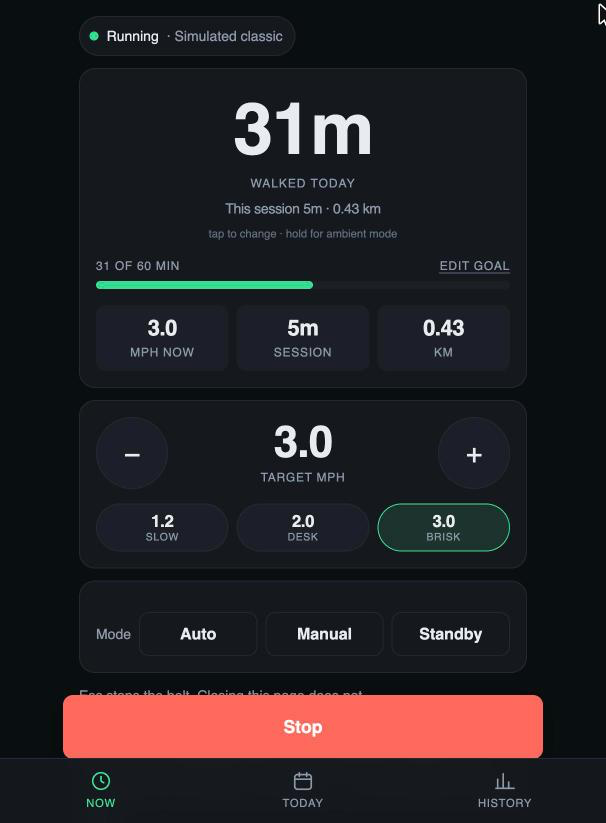
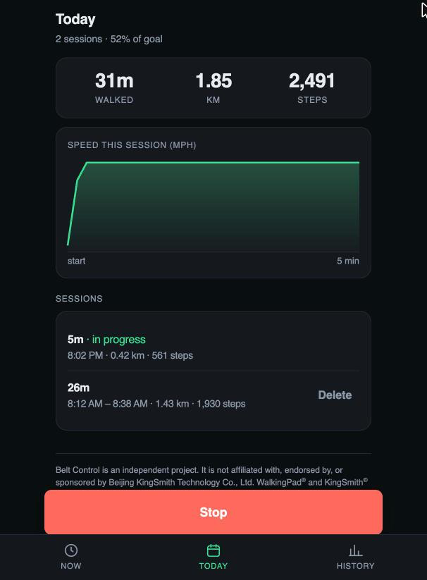
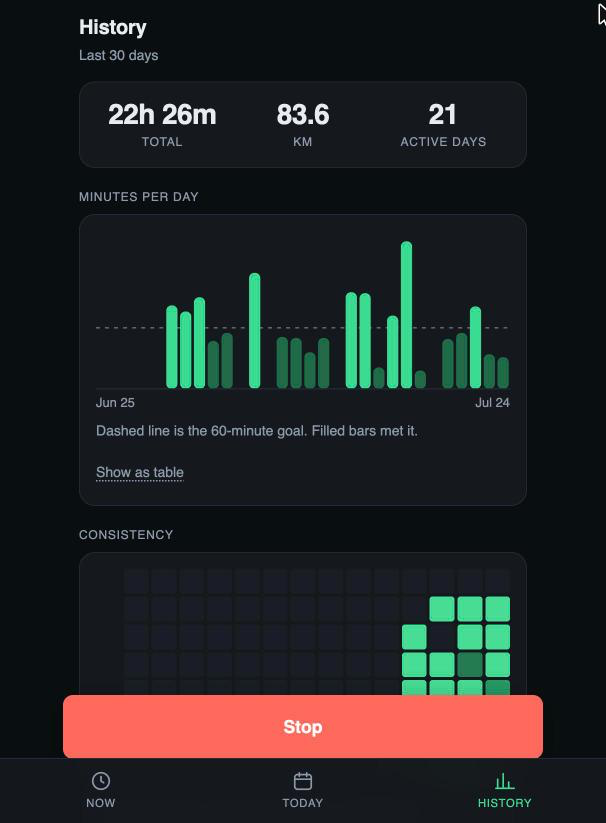

# Belt Control

An independent web app that connects to a treadmill speaking the KingSmith / WalkingPad
Bluetooth protocols to start it, stop it, set speed, read live telemetry, and keep a private
history of every walk — without the KS+Fit phone app.

> **Not affiliated with Beijing KingSmith Technology Co., Ltd.** WalkingPad® and KingSmith®
> are their trademarks, referred to here only to identify which treadmills this app can talk
> to. See [Trademarks and independence](#trademarks-and-independence).

Everything runs in the browser. The BLE link is browser → treadmill over the local radio; the
server only ships static files and never sees any telemetry. Session history lives in
`localStorage` and is never uploaded.

| Now | Today | History |
|:---:|:---:|:---:|
|  |  |  |

<sub>Captured against the built-in simulator — hence "Simulated classic" on the status chip.
A real pad reports its own name there.</sub>

```
index.html              Vite entry
src/main.tsx            bootstrap, guards, service-worker registration
src/app.tsx             shell, hash router, tab bar
src/routes/             Now · Today · History
src/components/         hero, speed control, tiles, stop bar, ambient mode, sheets
src/charts/             hand-rolled inline SVG: column, area, heatmap
src/state/              connection · telemetry · session · settings · log
src/lib/drivers.js      the protocol drivers — plain JS, deliberately untouched
src/lib/drivers.d.ts    hand-written types for the above
src/lib/simulator.ts    fake pad for development (dropped from production builds)
src/styles/tokens.css   the single source of truth for colour, type and spacing
public/                 manifest, icons, service worker
test/                   unit tests — protocol decoding, session maths, formatting
serve.sh                local dev server
vercel.json             hosting config
```

Speeds are shown in **mph**. Everything on the wire stays metric — the protocols all speak
km/h — so miles are a display concern only.

## The interface

Three tiers, each on its own screen, reachable from the bottom tab bar:

| Screen | Question it answers |
|---|---|
| **Now** | What is the belt doing, and how do I change it? |
| **Today** | What have I done today, and in which sessions? |
| **History** | Am I actually keeping this up? |

Design notes worth knowing before changing anything:

- **The hero number cycles.** Tapping it moves between time, distance, steps and calories —
  *skipping whatever the connected protocol cannot report*. FTMS carries no step count and
  neither the classic nor the `0x1234` frame carries calories, so a fixed six-tile grid
  guaranteed permanent em dashes on every real device. Availability is resolved once, at
  connect time, from `capabilities` plus the trust map in `src/state/telemetry.ts`.
- **Three speed presets.** The steppers move 0.2 mph per press to stay inside the
  0.5 km/h safety limit, which makes 1.2 → 3.0 mph nine presses. Desk walkers live at two or
  three fixed speeds, so those get chips.
- **Stop is pinned.** While the belt moves, Stop is fixed above the tab bar and cannot be
  scrolled away. `Esc` still works everywhere.
- **Ambient mode.** Hold the hero number: full-screen giant readout holding a
  `navigator.wakeLock`, with Stop always visible. Wake Lock is supported in exactly the same
  browsers as Web Bluetooth, so it adds no new requirement. It is deliberately *not* a
  celebration screen — it sits in peripheral vision for hours, so its job is to be legible
  and then ignorable.
- **Status is never colour-alone.** Every belt-state dot ships a text label. Measured reason:
  the warn (`#e0a33a`) and bad (`#ff6b5e`) tokens separate by only ΔE 5.7 under deuteranopia.
- **Charts are single-hue and hand-rolled.** No chart library. The sequential ramp in
  `tokens.css` was solved numerically for monotone OKLab lightness, adjacent ΔL ≥ 0.06, and
  ≥ 2:1 contrast between the lightest data step and the card surface — in both themes.

## Sessions and history

Sessions are detected from telemetry, not from the Start button, so a walk still records when
the belt is started from its own remote or handrail.

- Opens on the first frame with speed > 0; closes after 60 s of stillness, or on disconnect.
- Anything under 30 s is discarded as noise.
- Duration is **wall-clock time with the belt moving**, measured locally. It is
  protocol-independent and immune to the pad's counter resets.
- An in-flight session is checkpointed every 5 s, so reloading mid-walk resumes rather than
  splitting the walk in two.
- `Export CSV` on the History screen dumps everything, trust columns included.

### Counter resets

The pads report cumulative-since-power-on counters that reset without warning. Differencing
them naively produces negative deltas that silently corrupt every total, so a drop is treated
as a reset: the accumulator rebases on the new value and keeps going. See `Counter` in
`src/state/session.ts`.

### Field trust

Not every number a pad sends means what it appears to mean, and the app refuses to pretend
otherwise. Each session records a trust map, derived from its protocol:

| Protocol | distance | steps | calories |
|---|---|---|---|
| classic `fe00` | ok | ok | absent |
| FTMS `1826` | ok | **absent** | ok |
| KingSmith `0x1234` | **unverified** | ok | **unverified** |
| FitShow `fff0` | absent | absent | absent |

`unverified` means the device sends a number whose scaling was never established (see
[Driver 4](#driver-4--kingsmith-0x1234-chip3)). Those values are kept raw on the session,
flagged with an amber marker in the UI, and **excluded from every aggregate** — a history
screen that quietly sums unscaled numbers as if they were kilometres is worse than no history
at all. Where that happens, the affected screen says so in plain text.

> **KS-C2 / chip:3 owners:** supported. The `0x1234` protocol was reverse engineered from an
> iOS HCI capture and is documented in full under [Driver 4](#driver-4--kingsmith-0x1234-chip3).

## Run it locally

```sh
./serve.sh              # → http://localhost:8080  (installs deps on first run)
# or
npm install && npm run dev
```

Open it in **Chrome or Edge**. `http://localhost` counts as a secure context, so no TLS is
needed. Opening the built files as `file://` will not work.

On macOS, Chrome needs Bluetooth permission under **System Settings → Privacy & Security →
Bluetooth**, otherwise the device chooser comes up empty with no error.

### Without a treadmill in reach

Web Bluetooth cannot be exercised without hardware, which would make the UI untestable on a
laptop. In dev builds only, the console exposes a fake pad:

```js
__wp.connectSimulated('classic')   // or 'ftms', 'ks1234', 'fitshow'
__wp.disconnect()
```

`import.meta.env.DEV` is statically false in a production build, so the simulator and the
console hook are dropped by the bundler.

## Tests

```sh
npm test                # vitest, one pass
npm run test:watch
npm run check           # tsc --noEmit over src and test
```

The suite is unit-level and needs neither a treadmill nor a browser. It covers the parts where
a silent wrong answer would be worse than a crash:

| File | What it pins down |
|---|---|
| `test/drivers.classic.test.ts` | `fe00` command framing and checksum, status decoding, 3-byte counters, junk frames ignored |
| `test/drivers.ftms.test.ts` | the `0x2ACD` flags walk, the inverted "More Data" bit, the `0xFFFF` energy sentinel, control-point acks and rejections |
| `test/drivers.ks1234.test.ts` | the permuted base64 codec, `props` parsing, 20-byte fragment reassembly, the connect handshake |
| `test/session.test.ts` | counter-reset rebasing, per-protocol trust exclusions, streaks, CSV export |
| `test/telemetry.test.ts` | merge-never-replace ingest, movement detection, the trust table |
| `test/format.test.ts` | duration and unit formatting, local-midnight day keys, a DST boundary |
| `test/metrics.test.ts` | which metrics each protocol may honestly display, and hero cycling |

`test/ble-mock.ts` is a small fake of the GATT surface the drivers touch — services,
characteristics, notifications, and a pad that can answer a write. That is what lets the
drivers be tested end-to-end rather than only their pure helpers.

Two things are deliberately **not** covered: the Preact components, which are thin over the
state modules and would mostly test the renderer; and the real BLE round trip, which no
amount of mocking can vouch for. `test/drivers.*.test.ts` encodes what the captures showed,
not what a pad in the room does.

## Deploy it

```sh
npm run build           # tsc --noEmit && vite build  → dist/
npx vercel --prod
```

`vercel.json` carries the whole hosting config. Its rules, since JSON has nowhere to say so:

- `/assets/*` is immutable for a year — Vite fingerprints those filenames, so the same name
  always means the same bytes.
- `index.html`, `sw.js` and `manifest.json` are `must-revalidate`. The shell, the worker and
  the manifest must never go stale, or a released fix sits behind a cached shell.
- `Permissions-Policy: bluetooth=(self)` keeps the radio available to this origin and nothing
  it embeds.

(Vercel's schema rejects unknown keys, so no `comment` fields — the file must stay plain.)

Vercel serves HTTPS, which is the other context Web Bluetooth accepts. Worth knowing: a Vercel
deployment URL is public by default. Nothing sensitive is exposed — the page is inert without
a treadmill in radio range — but you can turn on Deployment Protection on the project if
you'd rather it not be reachable.

Hosting it is genuinely useful for **Chrome on Android**: open the URL on a phone or tablet
propped on the treadmill and install it to the home screen from the manifest.

## Browser support

Verified against MDN browser-compat-data for `Bluetooth.requestDevice`:

| Browser | Supported |
|---|---|
| Chrome 56+ / Edge / Opera / Samsung Internet | yes |
| Chrome on Android | yes |
| Firefox (desktop and Android) | **no** — never implemented |
| Safari, **including Safari on iOS** | **no** — never implemented |

There is no way around the Safari gap; an iPhone would need a third-party WebBLE browser.
This is a browser limitation, not a hosting one.

Phones and tablets get a dismissible "best on desktop" banner at the top of the shell
(`src/components/DesktopOnlyNotice.tsx`), so nobody has to discover this by tapping Connect
and getting nothing. Detection lives in `src/lib/platform.ts`; in dev, `?forcemobile` shows
the banner on a desktop.

## First run

Hit **Connect**. The app probes the GATT table and picks the driver itself — it does not rely
on the model name. The protocol it settled on is shown in the connection sheet (tap the status
chip at the top of the Now screen) and logged.

If your unit exposes none of the four known services the log says so explicitly, naming each
one it looked for.

---

# Protocol reference

Reverse engineered from **KS+Fit 6.5.6** (`com.kingsmith.xiaojin`, APKPure XAPK).

## How the official app works

The app is **Flutter**. All Bluetooth logic is Dart AOT-compiled into
`lib/armeabi-v7a/libapp.so` (34 MB), in a first-party package `ks_blue`
(`ks_blue/src/{ble,wilink,fitshow,rower,dumbbell,...}`). The Java/Kotlin dex files contain no
BLE code — they are analytics, push, Huawei HMS, and media SDKs.

**Pairing is unauthenticated on the classic and FTMS paths.** There is no PIN, no bonding
requirement, no key exchange, no challenge/response, and no cloud token gate.
`WilinkDevice._internal` connects, subscribes to notifications (`_addAllNotifyAndRead`,
`_initNotifyEvent`), and writes commands.

The `chip:3` / `0x1234` path is different: a real KS-C2 **drops the link 1.8–3.6 s after
connecting** unless a handshake is written. It is still not authenticated — there is no
secret, and the handshake is a fixed sequence anyone can replay — but a passive client that
never writes cannot stay connected, which is why this protocol went undocumented for so long.
See [Driver 4](#driver-4--kingsmith-0x1234-chip3).

**Discovery is name-prefix filtering.** `DeviceScanManager` (`_loadFilterWords`,
`_buildFilterMappings`, `_filterUnwantedDevices`) matches advertised device names against
`leach_word` entries in `assets/flutter_assets/assets/mine/allProducts.json` — a catalog of 83
products. Each entry carries:

- `chip` (2/3/5/6) — selects the protocol
- `deviceType` — 0 treadmill, 1 walking pad, 2 spinning, 3 dumbbell, 4 rowing, 5 bench,
  7 crawler, 8 stair climber
- `speed` — the model's max speed in km/h
- `leach_word` — comma-separated BLE name prefixes

`_parseServiceUuidProtocol` / `_getDeviceTypeByProtocol` then confirm the choice from the
advertised service UUIDs. This app follows the same approach, but skips the catalog and
detects purely from the GATT table, which is more robust.

## The protocol families

| Family | Service | Notify | Write | Models | Status |
|---|---|---|---|---|---|
| Classic "WalkingPad" | `0000fe00` | `0000fe01` | `0000fe02` | `chip:2` — A1, A1 Pro, C1, C2, P1, R1 Pro, R2, K12, K15, T1, KS-F0/F1 | implemented |
| **FTMS** (Bluetooth SIG standard) | `00001826` | `2acd`, `2ada` | `2ad9` | `chip:5` — Z1, Z3, P1E, MT1, W1, X21, X26, G2, MX8, K50S, K20S, … | implemented |
| FitShow | `0000fff0` | `0000fff1` | `0000fff2` | some OEM units (`ks_blue/src/fitshow/`) | detect only |
| **KingSmith `0x1234`** | `00001234` | `0000fed8` | `0000fed7` | `chip:3` — **KS-C2**, G1, G1 Pro, MX16, X21, K12 Pro, KS-K9 | implemented |

Do not assume `chip` maps to protocol the way the first three rows suggest — `chip:3` was
initially missed here precisely because of that assumption. Detect from the GATT table.

None of these UUIDs appear on the W3C Web Bluetooth
[`gatt_blocklist.txt`](https://github.com/WebBluetoothCG/registries), so a web page is
permitted to use them.

### Driver 1 — Classic WalkingPad (`0000fe00`)

Command frame, written to `fe02`:

```
F7 A2 <cmd> <param> <crc> FD        crc = (0xA2 + cmd + param) & 0xFF
```

| Action | Frame |
|---|---|
| Ask stats | `F7 A2 00 00 A2 FD` |
| Set speed | `F7 A2 01 <0.1 km/h> <crc> FD` — param `0` stops the belt |
| Set mode | `F7 A2 02 <0 auto / 1 manual / 2 standby> <crc> FD` |
| Start belt | `F7 A2 04 01 A7 FD` |

Start is mode-then-start: `setMode(manual)` → `start` → `setSpeed(n)`.
Stop is `setSpeed(0)` → `setMode(standby)`. Commands sent back-to-back get dropped, so the
driver spaces them ~120 ms apart.

Notifications arrive on `fe01`. Integers are **big-endian**.

Current status — header `F8 A2`, 18 bytes:

| Bytes | Field |
|---|---|
| `[2]` | belt state |
| `[3]` | speed ÷10 → km/h |
| `[4]` | mode |
| `[5..7]` | elapsed seconds |
| `[8..10]` | distance ÷100 → km |
| `[11..13]` | steps |
| `[14]` | app speed ÷30 |
| `[16]` | controller button |

Last-session record — header `F8 A7`: `[8..10]` time, `[11..13]` distance, `[14..16]` steps.

The pad does **not** push status on its own, so the app polls `askStats()` once per second.

Belt-state codes are not spelled out anywhere in the APK. `drivers.js` maps them to
best-effort labels and the UI shows the raw number alongside, so a wrong guess is visible
rather than silently misleading.

Frame layout cross-checked against [`ph4-walkingpad`](https://github.com/ph4r05/ph4-walkingpad)
(`ph4_walkingpad/pad.py`), whose UUIDs match those found in the APK exactly.

### Driver 2 — FTMS (`00001826`)

Standard Bluetooth SIG Fitness Machine Service, so this is spec-driven rather than reverse
engineered. Control Point `2ad9` (write + indicate), **little-endian**:

| Action | Bytes |
|---|---|
| Request Control — must be first | `00` |
| Reset | `01` |
| Set Target Speed | `02 <uint16 lo> <hi>` in 0.01 km/h |
| Start / Resume | `07` |
| Stop | `08 01` |
| Pause | `08 02` |

Acknowledgements arrive as indications `80 <reqOpCode> <result>`, where `result == 0x01` is
success. Every command is gated on its ack and failures surface in the UI — the app itself
ships a `ftms_control_fail_tips` string, so rejection is expected in practice. Most units drop
control permission on stop, so the driver re-requests it.

**Treadmill Data (`2acd`)** is a `uint16` flag field followed by only the present fields, in
spec order. Layout varies per device, so `parseTreadmillData()` walks the flags with a cursor
rather than using fixed offsets:

| Bit | Field(s) |
|---|---|
| 0 | *More Data* — instantaneous speed `uint16` 0.01 km/h is present when this bit is **clear** |
| 1 | average speed `uint16` 0.01 km/h |
| 2 | total distance `uint24` m |
| 3 | inclination `sint16` 0.1 %, ramp angle `sint16` 0.1° |
| 4 | elevation gain up/down `uint16` 0.1 m |
| 5, 6 | instantaneous / average pace `uint8` 0.1 km/min |
| 7 | total energy `uint16` kcal, per hour `uint16`, per minute `uint8` |
| 8 | heart rate `uint8` bpm |
| 9 | METs `uint8` 0.1 |
| 10 | elapsed time `uint16` s |
| 11 | remaining time `uint16` s |
| 12 | force on belt `sint16` N, power `sint16` W |

Also used: `2ada` Fitness Machine Status (state changes), `2acc` Feature (capabilities), and
`2ad4` Supported Speed Range (min/max/increment) to clamp the speed control to what the unit
actually accepts.

**FTMS carries no step count.** The dashboard shows `—` for steps on FTMS devices rather than
inventing a number.

### Driver 3 — FitShow (`0000fff0`)

Detected and observed only. The driver subscribes to `fff1` and logs raw frames; control is
not implemented because the framing has not been confirmed against a real unit. If your pad
lands here, share the log and it can be decoded properly.

### Driver 4 — KingSmith `0x1234` (chip:3)

Decoded from an iOS Bluetooth HCI capture of KS+Fit driving a real **KS-C2**. As far as I can
tell this protocol has not been published anywhere before.

```
transport : write -> fed7 (write-without-response),  notify <- fed8
framing   : ksBase64(plaintext) + "\r", fragmented across 20-byte ATT writes
payload   : plain text, space separated — "props CurrentSpeed 1.1"
```

**The encoding is base64 with a permuted alphabet**, a 64-char literal in `libapp.so`:

```
custom  SaCw4FGHIJqLhN+P9RVTU/WcY6ObDdefgEijklmnopQrsBuvMxXz1yA2t5078KZ3
std     ABCDEFGHIJKLMNOPQRSTUVWXYZabcdefghijklmnopqrstuvwxyz0123456789+/
```

Index 62 (`Z`) never appears in the captured traffic, so that one slot is inferred; every
other position is confirmed against real bytes. The literal in the binary has `Z` and `S`
transposed relative to this — solving the alphabet from known plaintext gives 100% printable
output only with them swapped, versus 96.6% as stored.

**Handshake.** The pad drops the link **1.8–3.6 s** after connecting unless this runs, which is
what makes the protocol undiscoverable by passive listening. Same order as the official app:

| → sent | ← reply |
|---|---|
| `shake` | `shake 00` |
| `time_posix <unix seconds>` | `time_posix 0` |
| `version` | `version 0014` |
| `servers getProp 1 3 7 8 9 16 17 18 19 21 22 23 24 13 15` | `servers 0`, then a full config dump |
| `props user_id <id>` | — |
| `get_pk` | `get_pk 3` |
| `props ControlMode 1` | `props ControlMode 1` |
| `servers getProp 1 9 15 2 10 11 12 13 14` | `servers 0` — subscribes to live telemetry |

`ControlMode 1` hands control to the app; `2` is the pad's own panel.

**Control**

| Action | Message |
|---|---|
| Start | `props runState 1` |
| Stop | `props runState 0` |
| Set speed | `props CurrentSpeed 1.1` (km/h, one decimal) |

**Telemetry** arrives on `fed8` as `props` lines, often **partial** — `props RunningSteps 3` on
its own is normal, so merge updates rather than replacing state:

`runState` (0 stopped, 1 running) · `CurrentSpeed` km/h · `RunningTotalTime` seconds ·
`RunningSteps` · `RunningDistance` · `BurnCalories`

The connect-time config dump also yields `Max` (6.0 on the C2 — matching the product catalog,
an independent confirmation the decode is correct), `StartSpeed`, `ChildLockSwitch`,
`VelocitySensitivity`, `PanelDisplay`, `unit`, `initial` and `mcu_version`.

Scaling for `RunningDistance` and `BurnCalories` is **not established** — both stayed at 0
through the short capture. `drivers.js` passes them through raw rather than guessing.

Verification: `ksEncode()` reproduces the official app's ciphertext **byte-for-byte** for
`shake`, `get_pk`, `props runState 1`, `props runState 0`, `props CurrentSpeed 1.1` and
`props ControlMode 1`.

**GATT surface** — one service, two characteristics, nothing else (no Device Information, no
Battery):

```
service 00001234-0000-1000-8000-00805f9b34fb
  char 0000fed7-...  [read, writeWithoutResponse]   ← host writes commands here
       = 36 41 2f 31 63 32 61 72 0d   "6A/1c2ar\r"   (this is ksBase64 for "get_pk")
  char 0000fed8-...  [read, notify]                 ← device reports here
       = 00 00 00 00 00 00 00 00 00 00 00 00 00     (13 zero bytes before the handshake)
```

`fed8` notifies about once a second even before the handshake, but carries an empty status
until the pad is woken. Reading `fed7` returns `get_pk` in encoded form — a leftover, and the
red herring that cost the most time here.

**How this was captured.** iOS HCI trace: Apple's *Bluetooth for iOS/iPadOS* logging profile
(developer.apple.com/bug-reporting/profiles-and-logs) plus PacketLogger from Additional Tools
for Xcode. Then:

```sh
tshark -r capture.pklg -Y 'btatt.opcode==0x52 && btatt.handle==0x000d' \
       -T fields -e frame.time_relative -e btatt.value    # app -> pad
tshark -r capture.pklg -Y 'btatt.opcode==0x1b && btatt.handle==0x0012' \
       -T fields -e frame.time_relative -e btatt.value    # pad -> app
```
Reassemble across writes on `\r`, then decode with the permuted alphabet above.

<details>
<summary>Approaches that failed before the capture — don't repeat these</summary>

| Attempt | Result |
|---|---|
| `strings` for the command literals | not present; the app builds them at runtime |
| Scan for any printable run terminated by `\r` | 231 hits, all UTF-16 noise, no templates |
| Object-pool xrefs to the `fed7`/`fed8`/`1234` string objects | **zero** — structural, see below |
| `blutter` (the Dart AOT reversing tool) | **arm64 only**; this binary is `armeabi-v7a` |
| Obtaining an arm64 build | APKPure serves v7a only (site + `apkeep`); APKMirror doesn't carry the app; Huawei has no build; Google Play needs account credentials |
| Treating `fed7`'s read value as the last-written command | wrong reasoning, right answer — it is a constant, but it *is* an encoded command (`get_pk`) |
| Keeping the link alive with GATT reads | fails; the pad still drops at 1.8–3.6 s |
| Passive sniffing | cannot work — without the handshake the pad disconnects before sending anything |

The xref failure is structural, not a mistake in method. `libapp.so` has **no relocation
section** (`objdump -h` shows only `.rodata`, `.text`, `.dynamic`, `.bss` and friends), so the
snapshot stores references as cluster-relative indices resolved during deserialization at
startup — not as pointers. Recovering that graph needs a full Dart snapshot parser, which is
what `blutter` is.

The string objects themselves decode cleanly, which is how the alphabet was eventually found:
Dart 32-bit `OneByteString` is `[tags:4][hash:4][length:Smi 4][chars]`, and a scan for any
64-char run that is a permutation of the standard base64 alphabet located it directly.

</details>

## Safety

The belt can start under software control with nobody on it. The app therefore:

- confirms before starting, showing the target speed
- clamps speed to the unit's real range (FTMS `2ad4`, or a conservative default)
- limits each speed press to ≤0.5 km/h
- keeps **Stop** always enabled, and binds it to <kbd>Esc</kbd>
- pins Stop to a fixed bar above the tab bar whenever the belt is moving, and keeps it on
  screen in ambient mode, so it can never be scrolled out of reach
- never auto-reconnects — silently reattaching to a possibly-moving belt with stale UI state
  is not a safe default
- warns before you navigate away while the belt is running

Closing the page does **not** stop the belt. Use the treadmill's own controls or remote as the
real safety stop.

## Reproducing the analysis

```sh
brew install jadx
unzip -q "KS+Fit_6.5.6_APKPure.xapk" -d xapk
unzip -q xapk/com.kingsmith.xiaojin.apk -d base            # dex, flutter_assets
unzip -q xapk/config.armeabi_v7a.apk -d v7a                # libapp.so

# UUIDs the Dart code actually references
strings -a v7a/lib/armeabi-v7a/libapp.so \
  | grep -oiE "[0-9a-f]{8}-[0-9a-f]{4}-[0-9a-f]{4}-[0-9a-f]{4}-[0-9a-f]{12}" | sort -u

# Dart source paths and class/method names survive AOT compilation
strings -a v7a/lib/armeabi-v7a/libapp.so | grep -oE "package:ks_blue/[a-zA-Z0-9_/.]+\.dart" | sort -u

# the product → protocol catalog
python3 -m json.tool base/assets/flutter_assets/assets/mine/allProducts.json
```

## Trademarks and independence

This project is not affiliated with, endorsed by, or sponsored by Beijing KingSmith
Technology Co., Ltd.

**WalkingPad®** and **KingSmith®** are trademarks of Beijing KingSmith Technology Co., Ltd.
(US Reg. 5815598 and 5815901, the latter covering downloadable mobile software). They appear
in this repository only where they are the accurate name of a thing being described — the
treadmills the app connects to, the `KS+Fit` app whose behaviour was analysed, the
`WalkingPad (classic fe00)` protocol family, the BLE advertised-name prefixes in
`src/state/connection.ts`. That is nominative use: there is no way to say what this software
is compatible with without naming the products.

What the project therefore does **not** do, deliberately:

- take the mark as its own product name, in the UI, the manifest, or a domain
- use KingSmith's logo, wordmark, colours or other trade dress
- present itself as official, licensed, or a replacement supported by the manufacturer
- charge for anything, carry advertising, or otherwise trade on the brand

The protocol work is clean-room-adjacent interoperability analysis of BLE traffic and a
publicly distributed binary, done to make hardware the author owns talk to software the
author wrote. Nothing from KS+Fit is redistributed here — see
[Reproducing the analysis](#reproducing-the-analysis), which tells you how to obtain the APK
yourself rather than shipping it.

If you fork this, keep the disclaimer in `src/components/Disclaimer.tsx` rendered.
