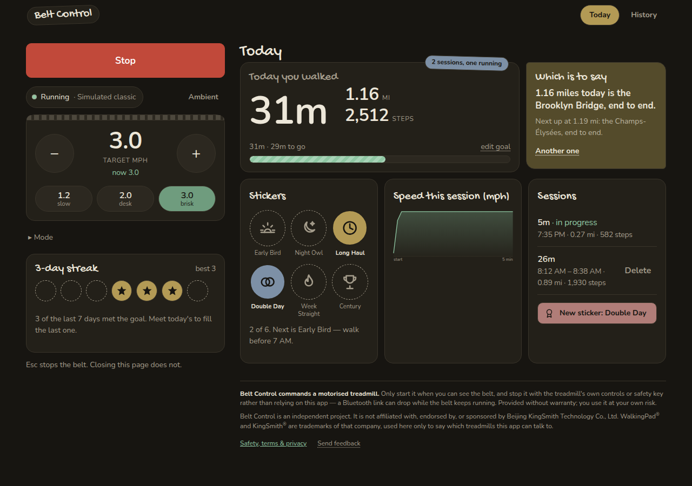
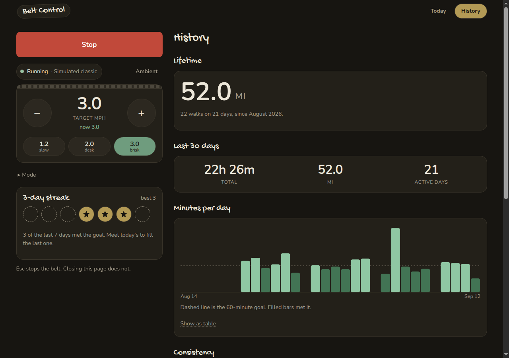

# Belt Control

An independent web app that connects to a treadmill speaking the KingSmith / WalkingPad
Bluetooth protocols to start it, stop it, set speed, read live telemetry, and keep a private
history of every walk — without the KS+Fit phone app.

**[beltcontrol.com](https://beltcontrol.com)**

> **Not affiliated with Beijing KingSmith Technology Co., Ltd.** WalkingPad® and KingSmith®
> are their trademarks, referred to here only to identify which treadmills this app can talk
> to. See [Trademarks and independence](docs/trademarks.md).

Everything runs in the browser. The BLE link is browser → treadmill over the local radio; the
server only ships static files and never sees any telemetry. Session history lives in
`localStorage` and is never uploaded — History exports it as a JSON backup you can import
into another browser, or as a CSV for a spreadsheet.

| Now | Today | History |
|:---:|:---:|:---:|
|  |  |  |

<sub>Captured against the built-in simulator — hence "Simulated classic" on the status chip.
A real pad reports its own name there.</sub>

## Will it work with my pad?

The app probes the GATT table on connect and picks a driver itself; it does not go by model
name. What you get depends on which protocol your unit speaks:

| Your pad speaks | Control | Distance | Steps | Calories |
|---|---|---|---|---|
| Classic `fe00` — A1, C1, C2, P1, R1/R2, K12, T1, … | full | yes | yes | — |
| FTMS `1826` — Z1, Z3, P1E, MT1, W1, X21, G2, … | full | yes | — | yes |
| KingSmith `0x1234` — **KS-C2**, G1, MX16, K12 Pro, … | full | unverified | yes | unverified |
| FitShow `fff0` — some OEM units | detect only | — | — | — |

`unverified` means the pad sends a number whose scaling was never established. Those are shown
raw, flagged, and excluded from every total rather than quietly summed as if they were
kilometres — see [Field trust](docs/design.md#field-trust).

**Browser support** is the real constraint. Verified against MDN browser-compat-data for
`Bluetooth.requestDevice`:

| Browser | Supported |
|---|---|
| Chrome 56+ / Edge / Opera / Samsung Internet | yes |
| Chrome on Android | yes |
| Firefox (desktop and Android) | **no** — never implemented |
| Safari, **including Safari on iOS** | **no** — never implemented |

There is no way around the Safari gap; an iPhone would need a third-party WebBLE browser.
This is a browser limitation, not a hosting one. Phones and tablets get a dismissible
"best on desktop" banner so nobody discovers it by tapping Connect and getting nothing.

## Run it

```sh
./serve.sh              # → http://localhost:8080  (installs deps on first run)
# or
npm install && npm run dev
```

Open it in **Chrome or Edge**. `http://localhost` counts as a secure context, so no TLS is
needed. Opening the built files as `file://` will not work.

On macOS, Chrome needs Bluetooth permission under **System Settings → Privacy & Security →
Bluetooth**, otherwise the device chooser comes up empty with no error.

Then hit **Connect**. The protocol the app settled on is shown in the connection sheet (tap
the status chip at the top of the Now screen) and logged. If your unit exposes none of the
four known services, the log says so explicitly, naming each one it looked for.

### Without a treadmill in reach

In dev builds only, the console exposes a fake pad:

```js
__wp.connectSimulated('classic')   // or 'ftms', 'ks1234', 'fitshow'
__wp.disconnect()
```

`import.meta.env.DEV` is statically false in a production build, so the simulator and the
console hook are dropped by the bundler.

### Test and deploy

```sh
npm test                # vitest — no hardware or browser needed
npm run check           # tsc --noEmit over src and test
npm run build           # → dist/
npx vercel --prod
```

Details in [Testing](docs/testing.md) and [Deploying](docs/deploying.md).

## Safety

The belt can start under software control with nobody on it. The app therefore:

- confirms before starting, showing the target speed
- clamps speed to the unit's real range (FTMS `2ad4`, or a conservative default)
- limits each speed press to ≤0.5 km/h
- keeps **Stop** always enabled, and binds it to <kbd>Esc</kbd>
- reports a stop only once the belt itself reports zero, and says plainly when it never
  does — a written command is not a stopped belt
- pins Stop to a fixed bar above the tab bar whenever the belt is moving, and keeps it on
  screen in ambient mode, so it can never be scrolled out of reach
- never auto-reconnects — silently reattaching to a possibly-moving belt with stale UI state
  is not a safe default
- warns before you navigate away while the belt is running

Closing the page does **not** stop the belt. Use the treadmill's own controls or remote as the
real safety stop.

## Documentation

| Doc | What's in it |
|---|---|
| [Protocol reference](docs/protocols.md) | All four BLE protocols frame by frame, and how they were reverse engineered — including the previously undocumented KingSmith `0x1234` family |
| [Interface and session design](docs/design.md) | Why the UI is shaped this way; session detection, counter resets, field trust |
| [Testing](docs/testing.md) | What the suite covers, the BLE mock, and what is deliberately left out |
| [Deploying](docs/deploying.md) | Hosting, the domain, and what every rule in `vercel.json` is for |
| [Trademarks and independence](docs/trademarks.md) | Nominative use, and what this project deliberately does not do |

## Layout

```
index.html              Vite entry
src/main.tsx            bootstrap, guards, service-worker registration
src/app.tsx             shell, hash router, tab bar
src/routes/             Now · Today · History
src/components/         hero, speed control, tiles, stop bar, ambient mode, sheets
src/charts/             hand-rolled inline SVG: column, area, heatmap
src/state/              connection · telemetry · session · settings · backup · log
src/lib/drivers.js      the protocol drivers — plain JS, deliberately untouched
src/lib/drivers.d.ts    hand-written types for the above
src/lib/simulator.ts    fake pad for development (dropped from production builds)
src/styles/tokens.css   the single source of truth for colour, type and spacing
public/                 manifest, icons, service worker
test/                   unit tests, plus a fake GATT surface in ble-mock.ts
docs/                   the documentation linked above
serve.sh                local dev server
vercel.json             hosting config
```

Speeds are shown in **mph**. Everything on the wire stays metric — the protocols all speak
km/h — so miles are a display concern only.
